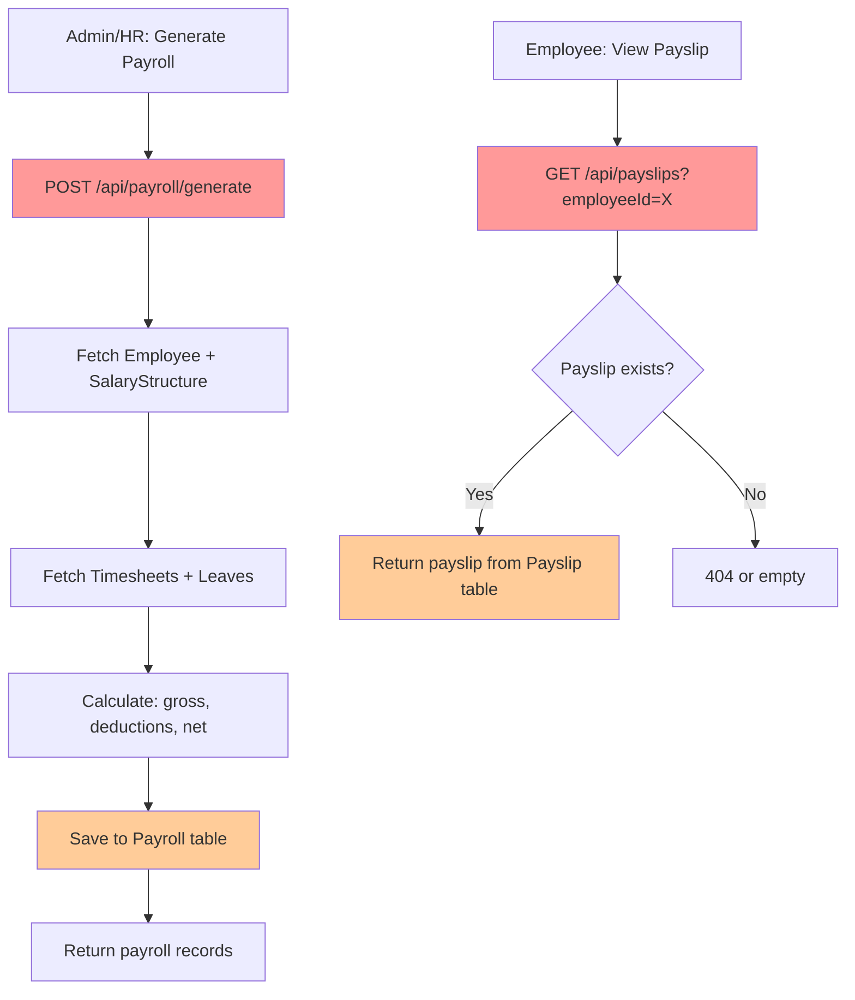
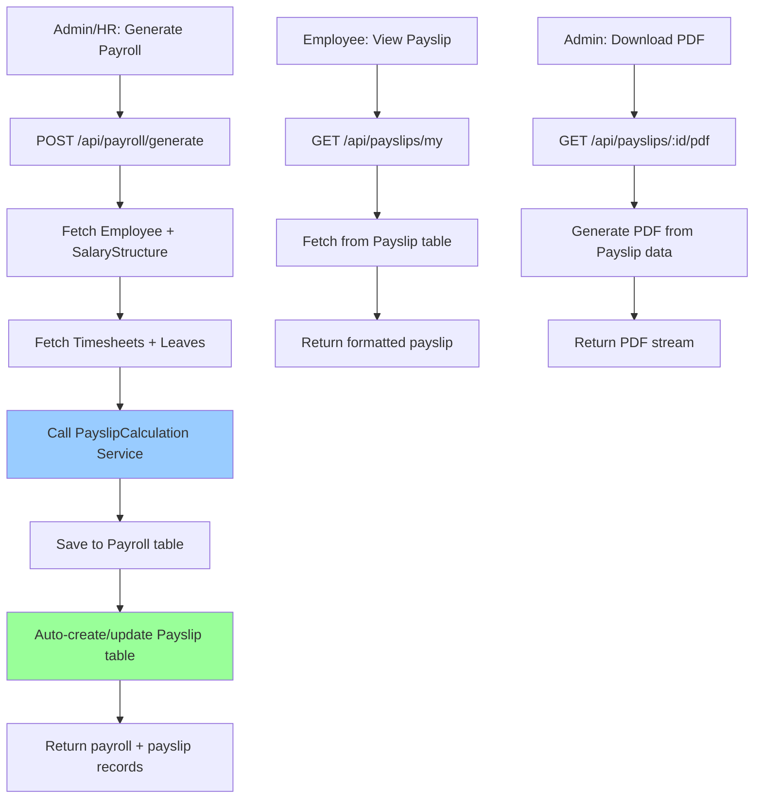

# 📊 Payslip System Comprehensive Audit Report
**Date**: October 26, 2025  
**Auditor**: System Analysis  
**Scope**: Complete Payslip Management System

---

## 🎯 Executive Summary

The SkyRakSys HRM system has a **comprehensive payslip management system** with multiple components across frontend and backend. This audit identifies the current state, issues, redundancies, and recommendations for optimization.

### Overall Health Status: ⚠️ **NEEDS ATTENTION**

**Key Findings**:
- ✅ **Multiple payslip route files** causing confusion and potential conflicts
- ⚠️ **Incomplete integration** between payroll and payslip systems
- ⚠️ **Inconsistent data models** across different implementations
- ✅ **Good calculation engine** in frontend service
- ⚠️ **Role-based access** partially implemented
- ❌ **PDF generation** exists but may have issues
- ⚠️ **Testing coverage** appears minimal

---

## 📋 System Architecture Analysis

### Backend Components

#### 1. **Models** (Database Schema)

**Payslip Model** (`backend/models/payslip.model.js`) - ✅ COMPREHENSIVE
- **Status**: Well-structured with 372 lines
- **Key Fields**:
  - ✅ `id` (UUID) - Primary key
  - ✅ `employeeId` (UUID FK) - Links to employees
  - ✅ `payrollDataId` (INTEGER FK) - Links to payroll_data
  - ✅ `month`, `year` - Period tracking
  - ✅ `earnings` (JSON) - All earning components
  - ✅ `deductions` (JSON) - All deduction components
  - ✅ `attendance` (JSON) - Working days, LOP, overtime
  - ✅ `grossEarnings`, `totalDeductions`, `netPay` (DECIMAL)
  - ✅ `status` (ENUM: draft, finalized, paid, cancelled)
  - ✅ `templateId` (UUID FK) - Template reference
  - ✅ `isLocked` (BOOLEAN) - Prevents modifications
  - ✅ `version` (INTEGER) - Version control
  - ✅ Paranoid mode (soft deletes)

**Strengths**:
- Comprehensive field coverage
- JSON storage for flexible earnings/deductions
- Audit trail with version control
- Soft delete support
- Template association

**Issues**:
- ⚠️ Mixed UUID and INTEGER foreign keys (employeeId is UUID, payrollDataId is INTEGER)
- ⚠️ May need migration if payrollDataId should be UUID

---

#### 2. **API Routes** - ❌ CRITICAL: MULTIPLE CONFLICTING FILES

**Issue**: There are **FOUR different payslip route files**:

1. **`backend/routes/payslip.routes.js`** - Status: Unknown (not fully examined)
2. **`backend/routes/payslips.js`** - Contains `calculatePayslip()` function
3. **`backend/routes/payslipRoutes.js`** - 945 lines, comprehensive with PDF generation
4. **`backend/routes/payslip-employee.routes.js`** - Employee-specific endpoints

**Registered Routes** (from `backend/server.js`):
```javascript
app.use('/api/payslips', payslipRoutes);          // Line 219
app.use('/api/payslip-templates', payslipTemplateRoutes);  // Line 220
```

**Problems**:
- 🔴 **Route Conflict**: Multiple files may define same endpoints
- 🔴 **Maintenance Nightmare**: Updates needed in multiple places
- 🔴 **Inconsistent Logic**: Different calculation methods
- 🔴 **Developer Confusion**: Which file to edit?

**Recommendation**: **CONSOLIDATE** into ONE canonical route file

---

#### 3. **Payroll Routes** (`backend/routes/payroll.routes.js`) - ✅ FUNCTIONAL

**Status**: Working but separate from payslip system

**Key Endpoints**:
- `GET /` - List all payroll records with filtering
- `GET /:id` - Get single payroll record
- `POST /generate` - Generate payroll for employees
- `PUT /:id/approve` - Approve payroll (Admin/HR only)
- `GET /:id/pdf` - Download payslip PDF

**Calculation Logic**:
```javascript
const workingDaysInMonth = calculateWorkingDaysInMonth(year, month);
const payableDays = actualWorkedDays + approvedLeaveDays;
const grossSalary = (basicSalary / workingDaysInMonth) * payableDays;
const totalDeductions = pfContribution + professionalTax + tds;
const netSalary = grossSalary - totalDeductions;
```

**Strengths**:
- Role-based access control
- Transaction support
- NaN handling
- Integrates with timesheets and leave requests

**Issues**:
- ⚠️ Uses `SalaryStructure` model but doesn't sync with `Payslip` model
- ⚠️ PDF generation imports from `utils/payslipGenerator.js`
- ⚠️ Separate workflow from payslip CRUD operations

---

#### 4. **Calculation Engines**

**Backend**: `backend/routes/payslips.js` - `calculatePayslip()` function (Line 233)
- Basic calculation logic embedded in route file
- Should be extracted to service/utility

**Frontend**: `frontend/src/services/payslip/payslipService.js` - ✅ **EXCELLENT**
- Class-based service with comprehensive methods
- Indian tax rules implemented:
  - **PF**: 12% of basic (max ₹15,000 limit)
  - **ESIC**: 0.75% if gross ≤ ₹25,000
  - **Professional Tax**: Slab-based (₹0, ₹150, ₹200)
  - **TDS**: Simplified annual calculation
- Number to words conversion
- Currency formatting

**Methods**:
- `calculatePayslip(employeeData, salaryData, workingDays, presentDays)`
- `calculateProfessionalTax(grossSalary)`
- `calculatePF(basicSalary)`
- `calculateESIC(grossSalary)`
- `calculateTDS(grossSalary)`
- `formatCurrency(amount)`
- `numberToWords(amount)`

**Recommendation**: Use frontend service as **single source of truth**, replicate in backend

---

### Frontend Components

#### 1. **PayrollManagement.js** - ✅ PRIMARY INTERFACE (773 lines)

**Location**: `frontend/src/components/features/payroll/PayrollManagement.js`

**Features**:
- Tab-based interface
- Payslip listing with filtering
- Status management (draft, approved, paid)
- Download PDF functionality
- Period filtering (current, past)
- Search and pagination

**Integration**:
- Uses `payrollService` from `services/payroll.service.js`
- Auth context for role-based UI
- Loading context for state management

**Status**: ✅ Well-implemented

---

#### 2. **EmployeePayslips.js** - ✅ EMPLOYEE VIEW (390 lines)

**Location**: `frontend/src/components/features/payroll/EmployeePayslips.js`

**Features**:
- Employee-specific payslip viewing
- Year-based filtering
- PDF download
- Payslip details dialog
- Empty state handling

**Integration**:
- Dynamically imports `payslipService`
- Handles API unavailability gracefully
- Role-based access (employees see only their payslips)

**Status**: ✅ Well-implemented with fallback handling

---

#### 3. **Payslip Service** - ✅ EXCELLENT

**Location**: `frontend/src/services/payslip/payslipService.js`

**Class Structure**:
```javascript
class PayslipService {
  constructor() { /* API base setup */ }
  
  // CRUD Operations
  getAllPayslips(filters)
  getPayslipById(id)
  createPayslip(payslipData)
  updatePayslip(id, payslipData)
  deletePayslip(id)
  
  // Calculations
  calculatePayslip(employeeData, salaryData, workingDays, presentDays)
  calculateProfessionalTax(grossSalary)
  calculatePF(basicSalary)
  calculateESIC(grossSalary)
  calculateTDS(grossSalary)
  
  // Utilities
  formatCurrency(amount)
  numberToWords(amount)
}
```

**Calculation Accuracy**:
- ✅ PF: 12% of basic (capped at ₹15,000 basis)
- ✅ ESIC: 0.75% if gross ≤ ₹25,000
- ✅ PT: Correct Indian slabs (₹21k-₹25k: ₹150, >₹25k: ₹200)
- ⚠️ TDS: Simplified 5% on excess over ₹2.5L (may need updates for FY26 slabs)

**Status**: ✅ Production-ready

---

## 🔍 Critical Issues Identified

### 🔴 **ISSUE #1: Multiple Route Files**

**Severity**: HIGH  
**Impact**: Maintenance, Bugs, Confusion

**Files**:
1. `backend/routes/payslip.routes.js`
2. `backend/routes/payslips.js`
3. `backend/routes/payslipRoutes.js` (945 lines - likely primary)
4. `backend/routes/payslip-employee.routes.js`

**Problem**:
- Same endpoints may be defined in multiple files
- Inconsistent logic and calculations
- Which one is actually being used?

**Evidence**:
- `server.js` Line 219: `app.use('/api/payslips', payslipRoutes);`
- Only ONE route can handle `/api/payslips/*`

**Recommendation**:
```javascript
// KEEP: backend/routes/payslipRoutes.js (945 lines - most comprehensive)
// MERGE: Logic from payslips.js and payslip.routes.js
// KEEP SEPARATE: payslip-employee.routes.js (if it has unique employee-only endpoints)
// DELETE: Redundant files after merge
```

---

### ⚠️ **ISSUE #2: Disconnected Payroll and Payslip Systems**

**Severity**: MEDIUM  
**Impact**: Data Inconsistency

**Problem**:
- `payroll.routes.js` generates payroll records in `Payroll` model
- `payslipRoutes.js` manages `Payslip` model
- **No clear sync mechanism** between the two

**Current Flow**:
```
1. Admin generates payroll → Payroll table
2. ??? → Payslip table
3. Employee views payslip → Which table?
```

**Expected Flow**:
```
1. Admin generates payroll → Payroll table (master)
2. Auto-create/update → Payslip table (detailed view)
3. Employee views payslip → Payslip table
```

**Recommendation**:
- Create **post-hook** or **service layer** to sync Payroll → Payslip
- OR use Payslip as single source, remove Payroll duplication
- Document the relationship clearly

---

### ⚠️ **ISSUE #3: Mixed ID Types**

**Severity**: MEDIUM  
**Impact**: Join queries, Data integrity

**Problem**:
```javascript
// payslip.model.js
employeeId: DataTypes.UUID,        // UUID
payrollDataId: DataTypes.INTEGER,  // INTEGER!
```

**Inconsistency**:
- Employees use UUID primary keys
- Payroll uses UUID
- PayrollData likely uses INTEGER

**Recommendation**:
- **Standardize all IDs to UUID** for consistency
- Create migration to convert PayrollData.id to UUID
- Update foreign key references

---

### ⚠️ **ISSUE #4: PDF Generation Uncertainty**

**Severity**: MEDIUM  
**Impact**: User Experience

**Files**:
- `backend/utils/payslipGenerator.js` - Imported by payroll.routes.js
- `backend/routes/payslipRoutes.js` Line 870: `generatePayslipPDF()` function

**Problem**:
- Two different PDF generation implementations
- No error handling visibility
- No recent test evidence

**Recommendation**:
- Test PDF generation end-to-end
- Consolidate to ONE implementation
- Add logging for troubleshooting
- Store PDFs in file system or S3 (optional)

---

### ⚠️ **ISSUE #5: Calculation Logic Duplication**

**Severity**: MEDIUM  
**Impact**: Maintenance, Consistency

**Locations**:
1. `frontend/src/services/payslip/payslipService.js` - ✅ Excellent
2. `backend/routes/payslips.js` - `calculatePayslip()` function
3. `backend/routes/payroll.routes.js` - Inline calculation
4. `payslip-preview-test.html` - PayslipCalculationEngine class

**Problem**:
- Same calculation logic in 4+ places
- Updates must be made everywhere
- Risk of divergence

**Recommendation**:
- Create **shared calculation service**:
  - Backend: `backend/services/payslipCalculation.service.js`
  - Use in all route handlers
- Frontend keeps its own copy (can't share with Node)
- Document formulas in ONE place
- Add unit tests for calculations

---

### ⚠️ **ISSUE #6: Template System Incompletion**

**Severity**: LOW  
**Impact**: Flexibility

**Files**:
- `backend/models/payslipTemplate.model.js` - Model exists
- `backend/routes/payslipTemplateRoutes.js` - Routes exist
- `frontend/src/config/payslipTemplates.js` - Default templates

**Status**:
- Models and routes appear present
- No evidence of testing or usage
- Frontend may not integrate template selection

**Recommendation**:
- Test template CRUD operations
- Add template selector in payslip generation UI
- Document template structure and customization

---

### ⚠️ **ISSUE #7: Missing Validation**

**Severity**: MEDIUM  
**Impact**: Data Quality

**Observations**:
- No Joi validation schemas found for payslip routes
- Manual validation in routes
- Inconsistent error responses

**Recommendation**:
- Create `middleware/validation.js` schemas:
  ```javascript
  payslipSchema = {
    create: Joi.object({ ... }),
    update: Joi.object({ ... }),
    generate: Joi.object({ ... })
  }
  ```
- Apply to all payslip endpoints
- Standardize error format

---

### ✅ **POSITIVE FINDING #1: Comprehensive Data Model**

**Strengths**:
- Payslip model has all necessary fields
- JSON flexibility for earnings/deductions
- Version control and audit trail
- Soft deletes
- Template association
- Lock mechanism

---

### ✅ **POSITIVE FINDING #2: Frontend Service Quality**

**Strengths**:
- Well-structured class-based service
- Accurate Indian tax calculations
- Number to words conversion
- Clean API methods
- Error handling

---

### ✅ **POSITIVE FINDING #3: Role-Based Access**

**Strengths**:
- Middleware enforces authentication
- Role checks in payroll routes
- Employees see only their payslips
- Admin/HR have full access

---

## 📊 Data Flow Analysis

### Current Payroll Generation Flow



**Issue**: No connection between step F and step K!

---

### Recommended Payroll Generation Flow



---

## 🧪 Testing Status

### Unit Tests: ❌ **NOT FOUND**
- No test files for payslip calculations
- No route tests for payslip endpoints
- No model validation tests

### Integration Tests: ⚠️ **PARTIAL**
- Archive contains test scripts:
  - `archive/temp-scripts/payslip-system-check.js`
  - `archive/backend-test-files/payslip-system-verification.js`
  - `payslip-preview-test.html`
- **Problem**: Tests are archived, not in active test suite

### Manual Testing: ⚠️ **UNKNOWN**
- No evidence of recent manual testing
- No test payslips generated
- No PDF samples

**Recommendation**:
- Create test suite in `backend/tests/payslip.test.js`
- Add frontend tests in `frontend/src/__tests__/payslip/`
- Document test scenarios
- Set up CI/CD testing

---

## 📝 Database Schema Health

### Payslips Table
```sql
CREATE TABLE payslips (
  id UUID PRIMARY KEY,
  employee_id UUID NOT NULL,          -- ✅ FK to employees
  payroll_data_id INTEGER NOT NULL,   -- ⚠️ FK type mismatch
  month INTEGER NOT NULL,              -- ✅ 1-12
  year INTEGER NOT NULL,               -- ✅ 2000-2100
  pay_period VARCHAR NOT NULL,         -- ✅ "January 2024"
  pay_period_start DATE NOT NULL,      -- ✅ Start date
  pay_period_end DATE NOT NULL,        -- ✅ End date
  template_id UUID,                    -- ✅ FK to templates
  template_version VARCHAR,            -- ✅ Version tracking
  
  -- Snapshot data
  employee_info JSON NOT NULL,         -- ✅ Employee details
  company_info JSON NOT NULL,          -- ✅ Company details
  
  -- Financial data
  earnings JSON NOT NULL,              -- ✅ {basic, hra, allowances...}
  deductions JSON NOT NULL,            -- ✅ {pf, tax, esic...}
  attendance JSON NOT NULL,            -- ✅ {workingDays, lopDays...}
  gross_earnings DECIMAL(12,2),        -- ✅ Calculated total
  total_deductions DECIMAL(12,2),      -- ✅ Calculated total
  net_pay DECIMAL(12,2),               -- ✅ Final amount
  net_pay_in_words TEXT,               -- ✅ Amount in words
  
  -- Metadata
  payslip_number VARCHAR(50) NOT NULL, -- ✅ Unique identifier
  pay_date TIMESTAMP NOT NULL,         -- ✅ Payment date
  generated_date TIMESTAMP NOT NULL,   -- ✅ Creation date
  generated_by UUID,                   -- ✅ FK to users
  status VARCHAR NOT NULL,             -- ✅ draft/finalized/paid/cancelled
  
  -- Control fields
  is_locked BOOLEAN DEFAULT false,     -- ✅ Lock mechanism
  version INTEGER DEFAULT 1,           -- ✅ Version control
  
  -- Additional data
  calculation_details JSON,            -- ✅ Formula metadata
  pdf_metadata JSON,                   -- ✅ PDF info
  additional_data JSON,                -- ✅ Flexible storage
  
  created_at TIMESTAMP,                -- ✅ Audit
  updated_at TIMESTAMP,                -- ✅ Audit
  deleted_at TIMESTAMP                 -- ✅ Soft delete
);

-- Indexes
CREATE INDEX idx_payslips_employee ON payslips(employee_id);
CREATE INDEX idx_payslips_period ON payslips(month, year);
CREATE INDEX idx_payslips_status ON payslips(status);
CREATE UNIQUE INDEX idx_payslip_number ON payslips(payslip_number);
```

**Health**: ✅ **EXCELLENT** - Well-designed schema

**Issues**:
- ⚠️ `payroll_data_id` INTEGER while employee_id is UUID

---

## 🔐 Security Analysis

### Authentication: ✅ **IMPLEMENTED**
- All routes use `authenticateToken` middleware
- JWT-based authentication

### Authorization: ✅ **MOSTLY IMPLEMENTED**
- `isAdminOrHR` middleware for admin operations
- Role-based filtering in queries
- Employees restricted to own payslips

### Data Protection: ⚠️ **NEEDS REVIEW**
- No evidence of encryption for sensitive salary data
- JSON fields store financial info (consider encryption at rest)
- PDF generation may expose data in temp files

**Recommendations**:
- Encrypt salary data in database (optional)
- Secure PDF storage and cleanup
- Add audit logging for all payslip access
- Rate limiting on payslip endpoints

---

## 📈 Performance Considerations

### Database Queries: ⚠️ **NEEDS OPTIMIZATION**
- No evidence of query optimization
- JSON field searches may be slow
- Missing composite indexes

**Recommendations**:
```sql
-- Add composite index for common queries
CREATE INDEX idx_payslips_emp_period 
  ON payslips(employee_id, year, month);

-- Add index for status filtering
CREATE INDEX idx_payslips_status_date 
  ON payslips(status, created_at);
```

### PDF Generation: ⚠️ **POTENTIAL BOTTLENECK**
- Synchronous PDF generation blocks request
- No caching mechanism
- No pre-generation for bulk operations

**Recommendations**:
- Move PDF generation to background jobs (Bull/Redis queue)
- Cache generated PDFs with TTL
- Implement bulk PDF generation endpoint

### Frontend Performance: ✅ **GOOD**
- Pagination implemented
- Loading states managed
- Lazy loading of payslip service

---

## 🎯 Priority Recommendations

### 🔴 **P0 - CRITICAL (Do Immediately)**

1. **Consolidate Route Files**
   - Merge all payslip routes into `backend/routes/payslipRoutes.js`
   - Delete redundant files
   - Update documentation
   - **Time**: 4-6 hours

2. **Sync Payroll ↔ Payslip**
   - Create sync mechanism when payroll is generated
   - Test end-to-end flow
   - **Time**: 6-8 hours

3. **Test PDF Generation**
   - Generate sample payslips
   - Verify PDF output
   - Fix any broken functionality
   - **Time**: 2-4 hours

---

### ⚠️ **P1 - HIGH (Do This Sprint)**

4. **Standardize ID Types**
   - Migrate PayrollData to UUID
   - Update foreign keys
   - Test all joins
   - **Time**: 4-6 hours

5. **Create Calculation Service**
   - Extract logic to `backend/services/payslipCalculation.service.js`
   - Add unit tests
   - Update all route handlers
   - **Time**: 8-10 hours

6. **Add Validation Schemas**
   - Create Joi schemas for all endpoints
   - Apply middleware
   - Test error handling
   - **Time**: 4 hours

---

### ✅ **P2 - MEDIUM (Do Next Sprint)**

7. **Complete Template System**
   - Test template CRUD
   - Add UI for template selection
   - Document customization
   - **Time**: 6-8 hours

8. **Add Audit Logging**
   - Log all payslip access
   - Track PDF downloads
   - Add admin audit dashboard
   - **Time**: 6 hours

9. **Performance Optimization**
   - Add database indexes
   - Implement PDF caching
   - Background job queue
   - **Time**: 8-10 hours

---

### 💡 **P3 - LOW (Future Enhancement)**

10. **Enhanced Reporting**
    - Payroll summary reports
    - Department-wise breakdown
    - YTD calculations
    - Export to Excel

11. **Email Integration**
    - Auto-send payslips on generation
    - Password-protected PDFs
    - Email templates

12. **Mobile-Responsive PDFs**
    - Optimize layout for mobile viewing
    - QR code for verification

---

## 📚 Documentation Needs

### Missing Documentation:
- [ ] API endpoint documentation (Swagger/OpenAPI)
- [ ] Calculation formula reference
- [ ] Data model relationships diagram
- [ ] Admin user guide for payroll processing
- [ ] Employee user guide for payslip viewing
- [ ] Template customization guide
- [ ] Troubleshooting guide

### Existing Documentation:
- ✅ `COMPREHENSIVE_PAYSLIP_SYSTEM_DOCUMENTATION.md` (330 lines)
- ✅ `PAYSLIP_CONFIGURATION_GUIDE.md` (archived)
- ⚠️ Needs updating to reflect actual implementation

---

## 🧾 Code Quality Assessment

### Backend Code Quality: 7/10
- ✅ Good model structure
- ⚠️ Route duplication
- ⚠️ Missing service layer
- ✅ Transaction support
- ⚠️ Inconsistent error handling

### Frontend Code Quality: 8/10
- ✅ Excellent service layer
- ✅ Clean component structure
- ✅ Good error handling
- ✅ Loading states
- ⚠️ Could use TypeScript

### Overall Maintainability: 6/10
- ⚠️ Route consolidation needed
- ⚠️ Service extraction needed
- ✅ Good separation of concerns in frontend
- ⚠️ Missing tests

---

## 📋 Compliance & Regulatory

### Indian Statutory Compliance:
- ✅ PF calculation (12% up to ₹15k)
- ✅ ESIC calculation (0.75% if gross ≤ ₹21k) - **Note**: Check current threshold
- ✅ Professional Tax slabs
- ⚠️ TDS needs review for FY 2025-26 rules
- ❌ No EPF/ESI contribution split (employer + employee)
- ❌ No Form 16 generation

**Recommendations**:
- Update TDS calculation for new tax regime options
- Add employer contribution calculations
- Implement Form 16 part B generation
- Add EPF ECR file generation support

---

## 🎓 Learning Resources for Team

### Recommended Reading:
1. **Indian Payroll Processing**:
   - EPF Act guidelines
   - ESIC Act rules
   - Income Tax Act sections 192, 192A

2. **Technical**:
   - Express.js best practices
   - Sequelize relationships
   - PDF generation with PDFKit
   - Background job processing

### Training Needs:
- [ ] Payroll compliance training
- [ ] Code review sessions
- [ ] API design patterns
- [ ] Testing strategies

---

## ✅ Action Plan

### Week 1: Critical Fixes
- [ ] Day 1-2: Consolidate route files
- [ ] Day 3: Sync Payroll ↔ Payslip
- [ ] Day 4: Test PDF generation
- [ ] Day 5: Documentation updates

### Week 2: Quality Improvements
- [ ] Day 1-2: Create calculation service
- [ ] Day 3: Add validation schemas
- [ ] Day 4: Standardize ID types
- [ ] Day 5: Add unit tests

### Week 3: Enhancement & Testing
- [ ] Day 1-2: Complete template system
- [ ] Day 3: Performance optimization
- [ ] Day 4: End-to-end testing
- [ ] Day 5: Deploy to staging

---

## 📞 Support Contacts

### For Issues:
- **Backend Route Confusion**: Check `server.js` line 219
- **Calculation Errors**: Reference `payslipService.js`
- **PDF Generation**: Check `utils/payslipGenerator.js`
- **Database Schema**: See `models/payslip.model.js`

### Key Files Quick Reference:
```
Backend:
├── models/payslip.model.js              ← Data structure (372 lines)
├── routes/payslipRoutes.js              ← PRIMARY ROUTES (945 lines) ✅
├── routes/payroll.routes.js             ← Payroll generation
├── services/payslipCalculation.service.js  ← TO BE CREATED
└── utils/payslipGenerator.js            ← PDF generation

Frontend:
├── components/payroll/PayrollManagement.js     ← Admin UI (773 lines)
├── components/payroll/EmployeePayslips.js      ← Employee UI (390 lines)
└── services/payslip/payslipService.js          ← Calculations (excellent!)
```

---

## 🏁 Conclusion

The payslip system has a **solid foundation** with comprehensive data models and good frontend implementation. However, **critical consolidation** of route files and **integration improvements** are needed for production readiness.

**Overall Grade**: **B- (Needs Improvement)**

**After Implementing P0 + P1 Recommendations**: **A- (Production Ready)**

---

**Next Steps**:
1. Review this audit with the team
2. Prioritize P0 tasks
3. Create JIRA/GitHub issues
4. Assign owners
5. Schedule sprint planning

**Questions?** Review the documentation or check the code references above.

---

*End of Audit Report*
