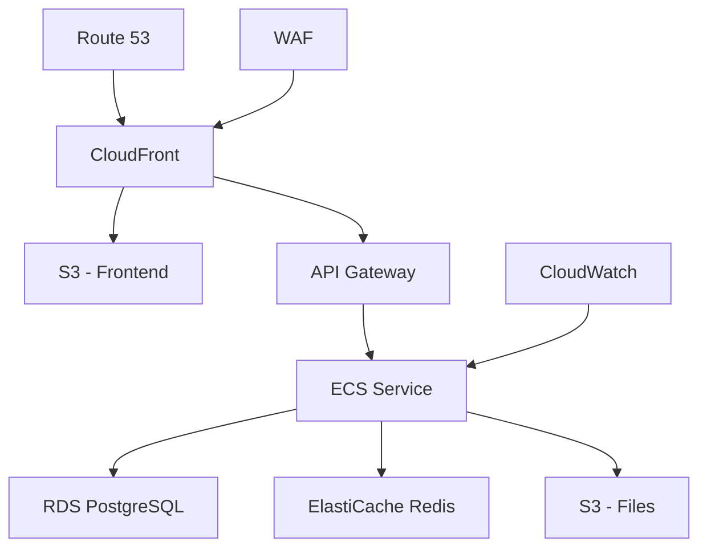

# AWS Setup Guide

## Overview
This document outlines the AWS infrastructure setup for the SkyRakSys HRM system.

## Infrastructure Overview

### 1. Architecture Diagram


## Resource Provisioning

### 1. VPC Setup
```yaml
Resources:
  VPC:
    Type: AWS::EC2::VPC
    Properties:
      CidrBlock: 10.0.0.0/16
      EnableDnsHostnames: true
      EnableDnsSupport: true
      Tags:
        - Key: Name
          Value: SkyRakSys-HRM-VPC

  PrivateSubnet1:
    Type: AWS::EC2::Subnet
    Properties:
      VpcId: !Ref VPC
      CidrBlock: 10.0.1.0/24
      AvailabilityZone: !Select [0, !GetAZs '']
      Tags:
        - Key: Name
          Value: Private-Subnet-1

  PrivateSubnet2:
    Type: AWS::EC2::Subnet
    Properties:
      VpcId: !Ref VPC
      CidrBlock: 10.0.2.0/24
      AvailabilityZone: !Select [1, !GetAZs '']
      Tags:
        - Key: Name
          Value: Private-Subnet-2
```

### 2. Database Configuration
```yaml
  DatabaseSubnetGroup:
    Type: AWS::RDS::DBSubnetGroup
    Properties:
      DBSubnetGroupDescription: Subnet group for RDS
      SubnetIds:
        - !Ref PrivateSubnet1
        - !Ref PrivateSubnet2

  DatabaseInstance:
    Type: AWS::RDS::DBInstance
    Properties:
      Engine: postgres
      DBInstanceClass: db.t3.micro
      AllocatedStorage: 20
      DBName: skyraksys_hrm
      MasterUsername: !Ref DBUsername
      MasterUserPassword: !Ref DBPassword
      DBSubnetGroupName: !Ref DatabaseSubnetGroup
      VPCSecurityGroups:
        - !Ref DatabaseSecurityGroup
      BackupRetentionPeriod: 7
      MultiAZ: true
```

### 3. ECS Configuration
```yaml
  ECSCluster:
    Type: AWS::ECS::Cluster
    Properties:
      ClusterName: skyraksys-hrm-cluster
      CapacityProviders:
        - FARGATE
      DefaultCapacityProviderStrategy:
        - CapacityProvider: FARGATE
          Weight: 1

  TaskDefinition:
    Type: AWS::ECS::TaskDefinition
    Properties:
      Family: skyraksys-hrm
      RequiresCompatibilities:
        - FARGATE
      NetworkMode: awsvpc
      Cpu: 256
      Memory: 512
      ContainerDefinitions:
        - Name: app
          Image: !Sub ${AWS::AccountId}.dkr.ecr.${AWS::Region}.amazonaws.com/skyraksys-hrm:latest
          PortMappings:
            - ContainerPort: 8080
          Environment:
            - Name: NODE_ENV
              Value: production
            - Name: DB_HOST
              Value: !GetAtt DatabaseInstance.Endpoint.Address
          LogConfiguration:
            LogDriver: awslogs
            Options:
              awslogs-group: !Ref LogGroup
              awslogs-region: !Ref AWS::Region
              awslogs-stream-prefix: ecs
```

### 4. CloudFront Setup
```yaml
  CloudFrontDistribution:
    Type: AWS::CloudFront::Distribution
    Properties:
      DistributionConfig:
        Enabled: true
        DefaultRootObject: index.html
        Origins:
          - Id: S3Origin
            DomainName: !GetAtt WebsiteBucket.DomainName
            S3OriginConfig:
              OriginAccessIdentity: !Sub origin-access-identity/cloudfront/${CloudFrontOriginAccessIdentity}
          - Id: APIOrigin
            DomainName: !Sub ${ApiGateway}.execute-api.${AWS::Region}.amazonaws.com
            CustomOriginConfig:
              OriginProtocolPolicy: https-only
        DefaultCacheBehavior:
          TargetOriginId: S3Origin
          ViewerProtocolPolicy: redirect-to-https
          CachePolicyId: 658327ea-f89d-4fab-a63d-7e88639e58f6
        CacheBehaviors:
          - PathPattern: /api/*
            TargetOriginId: APIOrigin
            ViewerProtocolPolicy: https-only
            CachePolicyId: 4135ea2d-6df8-44a3-9df3-4b5a84be39ad
```

## Security Configuration

### 1. Security Groups
```yaml
  ApplicationSecurityGroup:
    Type: AWS::EC2::SecurityGroup
    Properties:
      GroupDescription: Security group for ECS tasks
      VpcId: !Ref VPC
      SecurityGroupIngress:
        - IpProtocol: tcp
          FromPort: 8080
          ToPort: 8080
          SourceSecurityGroupId: !Ref LoadBalancerSecurityGroup

  DatabaseSecurityGroup:
    Type: AWS::EC2::SecurityGroup
    Properties:
      GroupDescription: Security group for RDS
      VpcId: !Ref VPC
      SecurityGroupIngress:
        - IpProtocol: tcp
          FromPort: 5432
          ToPort: 5432
          SourceSecurityGroupId: !Ref ApplicationSecurityGroup
```

### 2. IAM Roles
```yaml
  TaskExecutionRole:
    Type: AWS::IAM::Role
    Properties:
      AssumeRolePolicyDocument:
        Version: '2012-10-17'
        Statement:
          - Effect: Allow
            Principal:
              Service: ecs-tasks.amazonaws.com
            Action: sts:AssumeRole
      ManagedPolicyArns:
        - arn:aws:iam::aws:policy/service-role/AmazonECSTaskExecutionRolePolicy
```

## Monitoring Setup

### 1. CloudWatch Configuration
```yaml
  LogGroup:
    Type: AWS::Logs::LogGroup
    Properties:
      LogGroupName: /ecs/skyraksys-hrm
      RetentionInDays: 30

  HighCPUAlarm:
    Type: AWS::CloudWatch::Alarm
    Properties:
      AlarmDescription: CPU utilization is high
      MetricName: CPUUtilization
      Namespace: AWS/ECS
      Statistic: Average
      Period: 300
      EvaluationPeriods: 2
      Threshold: 80
      AlarmActions:
        - !Ref AlarmTopic
      Dimensions:
        - Name: ClusterName
          Value: !Ref ECSCluster
        - Name: ServiceName
          Value: !Ref ECSService
```

## Cost Optimization

### 1. Auto Scaling
```yaml
  ServiceScalingTarget:
    Type: AWS::ApplicationAutoScaling::ScalableTarget
    Properties:
      MaxCapacity: 4
      MinCapacity: 1
      ResourceId: !Sub service/${ECSCluster}/${ECSService.Name}
      ScalableDimension: ecs:service:DesiredCount
      ServiceNamespace: ecs

  ServiceScalingPolicy:
    Type: AWS::ApplicationAutoScaling::ScalingPolicy
    Properties:
      PolicyName: CPUScaling
      PolicyType: TargetTrackingScaling
      ScalingTargetId: !Ref ServiceScalingTarget
      TargetTrackingScalingPolicyConfiguration:
        TargetValue: 70
        PredefinedMetricSpecification:
          PredefinedMetricType: ECSServiceAverageCPUUtilization
```

### 2. S3 Lifecycle Rules
```yaml
  WebsiteBucket:
    Type: AWS::S3::Bucket
    Properties:
      LifecycleConfiguration:
        Rules:
          - Id: TransitionToIA
            Status: Enabled
            Transitions:
              - StorageClass: STANDARD_IA
                TransitionInDays: 30
```

## Deployment

### 1. Environment Variables
```yaml
  TaskDefinition:
    Properties:
      ContainerDefinitions:
        - Environment:
            - Name: DB_HOST
              Value: !GetAtt DatabaseInstance.Endpoint.Address
            - Name: DB_PORT
              Value: 5432
            - Name: DB_NAME
              Value: skyraksys_hrm
            - Name: DB_USER
              Value: !Ref DBUsername
            - Name: DB_PASSWORD
              Value: !Ref DBPassword
            - Name: REDIS_HOST
              Value: !GetAtt CacheCluster.RedisEndpoint.Address
            - Name: JWT_SECRET
              Value: !Ref JWTSecret
```

### 2. CI/CD Pipeline
```yaml
  CodePipeline:
    Type: AWS::CodePipeline::Pipeline
    Properties:
      RoleArn: !GetAtt CodePipelineRole.Arn
      Stages:
        - Name: Source
          Actions:
            - Name: Source
              ActionTypeId:
                Category: Source
                Owner: AWS
                Provider: CodeCommit
                Version: 1
              Configuration:
                RepositoryName: skyraksys-hrm
                BranchName: main
        - Name: Build
          Actions:
            - Name: Build
              ActionTypeId:
                Category: Build
                Owner: AWS
                Provider: CodeBuild
                Version: 1
              Configuration:
                ProjectName: !Ref CodeBuildProject
```

## Best Practices

1. **Security**
   - Use VPC endpoints
   - Implement WAF rules
   - Enable CloudTrail
   - Regular key rotation
   - Encrypt sensitive data

2. **High Availability**
   - Multi-AZ deployment
   - Auto scaling
   - Load balancing
   - Database replication
   - Regular backups

3. **Cost Management**
   - Right-sizing instances
   - Reserved instances
   - Auto scaling policies
   - S3 lifecycle rules
   - CloudWatch monitoring

4. **Performance**
   - CloudFront caching
   - RDS optimizations
   - ECS task sizing
   - Connection pooling
   - Regular monitoring

## References
- [CI/CD Guide](./CICD_GUIDE.md)
- [Monitoring Guide](./MONITORING.md)
- [Production Setup](../../PROD/docs/PRODUCTION_SETUP_GUIDE.md)
- [Security Guide](../development/SECURITY.md)