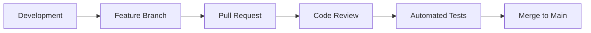
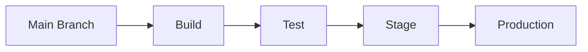

# CI/CD Guide

## Overview
This document outlines the continuous integration and deployment pipeline for the SkyRakSys HRM system.

## CI/CD Pipeline Structure

### 1. Development Flow


### 2. Deployment Flow


## GitHub Actions Workflows

### 1. Pull Request Checks
```yaml
name: PR Checks

on:
  pull_request:
    branches: [ main ]

jobs:
  validate:
    runs-on: ubuntu-latest
    steps:
      - uses: actions/checkout@v3
      - uses: actions/setup-node@v3
        with:
          node-version: '16'
      - run: npm ci
      - run: npm run lint
      - run: npm run test
      - run: npm run build
```

### 2. Deployment Pipeline
```yaml
name: Deploy

on:
  push:
    branches: [ main ]

jobs:
  deploy:
    runs-on: ubuntu-latest
    steps:
      - uses: actions/checkout@v3
      
      - name: Configure AWS
        uses: aws-actions/configure-aws-credentials@v1
        with:
          aws-access-key-id: ${{ secrets.AWS_ACCESS_KEY_ID }}
          aws-secret-access-key: ${{ secrets.AWS_SECRET_ACCESS_KEY }}
          aws-region: us-east-1
      
      - name: Build
        run: |
          npm ci
          npm run build
          
      - name: Deploy to Stage
        if: github.ref == 'refs/heads/main'
        run: |
          aws s3 sync build/ s3://stage-bucket
          aws cloudfront create-invalidation --distribution-id ${{ secrets.STAGE_DIST_ID }}
      
      - name: Deploy to Production
        if: github.ref == 'refs/heads/main' && github.event_name == 'release'
        run: |
          aws s3 sync build/ s3://prod-bucket
          aws cloudfront create-invalidation --distribution-id ${{ secrets.PROD_DIST_ID }}
```

## Environment Configuration

### 1. Development
```env
NODE_ENV=development
API_URL=http://localhost:8080
DB_HOST=localhost
LOG_LEVEL=debug
```

### 2. Staging
```env
NODE_ENV=staging
API_URL=https://api.stage.skyraksys.com
DB_HOST=stage-db.skyraksys.com
LOG_LEVEL=info
```

### 3. Production
```env
NODE_ENV=production
API_URL=https://api.skyraksys.com
DB_HOST=prod-db.skyraksys.com
LOG_LEVEL=warn
```

## Infrastructure as Code

### 1. AWS CloudFormation Template
```yaml
AWSTemplateFormatVersion: '2010-09-09'
Description: 'SkyRakSys HRM Infrastructure'

Resources:
  WebsiteBucket:
    Type: AWS::S3::Bucket
    Properties:
      BucketName: !Sub ${Environment}-skyraksys-hrm
      WebsiteConfiguration:
        IndexDocument: index.html
        ErrorDocument: error.html

  DatabaseInstance:
    Type: AWS::RDS::DBInstance
    Properties:
      Engine: postgres
      DBName: skyraksys_hrm
      MasterUsername: !Ref DBUsername
      MasterUserPassword: !Ref DBPassword
      DBInstanceClass: db.t3.micro
```

## Deployment Process

### 1. Build Process
```bash
# Install dependencies
npm ci

# Run tests
npm run test

# Build application
npm run build

# Create Docker image
docker build -t skyraksys-hrm:latest .
```

### 2. Database Migration
```bash
# Run migrations
npm run migrate

# Verify migration
npm run migrate:status
```

### 3. Deployment Steps
```bash
# Deploy to staging
./deploy.sh staging

# Run smoke tests
npm run test:smoke

# Deploy to production
./deploy.sh production
```

## Monitoring & Alerts

### 1. CloudWatch Alarms
```yaml
Resources:
  HighErrorRateAlarm:
    Type: AWS::CloudWatch::Alarm
    Properties:
      AlarmDescription: High error rate detected
      MetricName: 5XXError
      Namespace: AWS/ApiGateway
      Statistic: Sum
      Period: 300
      EvaluationPeriods: 2
      Threshold: 10
      AlarmActions:
        - !Ref AlertsTopic
```

### 2. Health Checks
```javascript
// health-check.js
async function performHealthCheck() {
  return {
    database: await checkDatabaseConnection(),
    redis: await checkRedisConnection(),
    api: await checkAPIEndpoints(),
    storage: await checkStorageAccess()
  };
}
```

## Rollback Procedures

### 1. Application Rollback
```bash
# Revert to previous version
./rollback.sh production 1

# Verify rollback
./health-check.sh
```

### 2. Database Rollback
```bash
# Revert last migration
npm run migrate:undo

# Restore from backup if needed
./restore-db.sh backup_20250901
```

## Security Measures

### 1. Secret Management
```yaml
name: Deploy
env:
  AWS_ACCESS_KEY_ID: ${{ secrets.AWS_ACCESS_KEY_ID }}
  AWS_SECRET_ACCESS_KEY: ${{ secrets.AWS_SECRET_ACCESS_KEY }}
  DB_PASSWORD: ${{ secrets.DB_PASSWORD }}
  JWT_SECRET: ${{ secrets.JWT_SECRET }}
```

### 2. Security Scanning
```yaml
jobs:
  security:
    runs-on: ubuntu-latest
    steps:
      - uses: actions/checkout@v3
      - name: Run SAST
        uses: github/codeql-action/analyze@v2
      - name: Run dependency scan
        run: npm audit
```

## Best Practices

1. **Automated Testing**
   - Run all tests before deployment
   - Include smoke tests
   - Monitor test coverage
   - Automated rollback on test failure

2. **Deployment Strategy**
   - Use blue-green deployment
   - Implement feature flags
   - Gradual rollout
   - Easy rollback mechanism

3. **Monitoring**
   - Real-time metrics
   - Error tracking
   - Performance monitoring
   - User analytics

4. **Security**
   - Secure secrets management
   - Regular security scans
   - Compliance checks
   - Access control

## References
- [Development Setup](../../DEVELOPMENT_SETUP.md)
- [Production Setup](../../PROD/docs/PRODUCTION_SETUP_GUIDE.md)
- [AWS Configuration](../deployment/AWS_SETUP.md)
- [Monitoring Guide](../deployment/MONITORING.md)